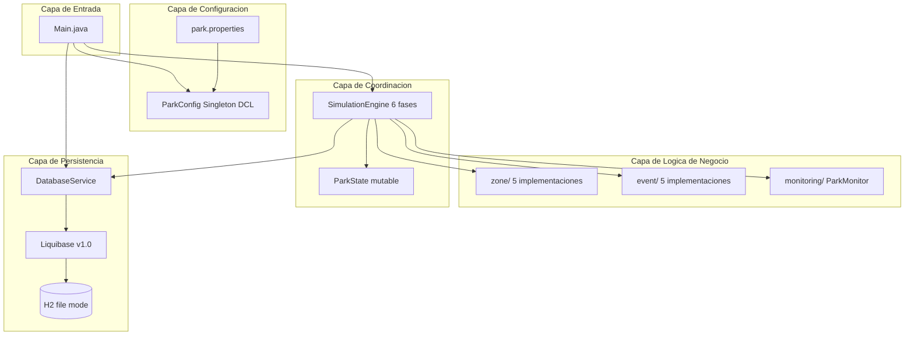
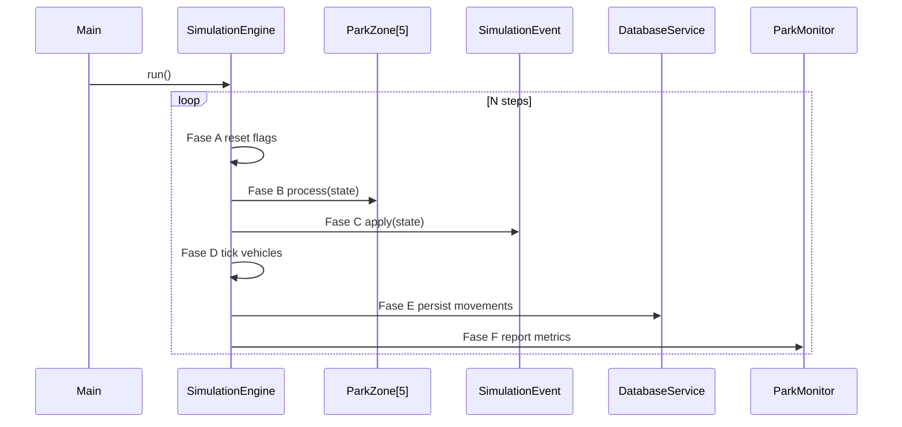
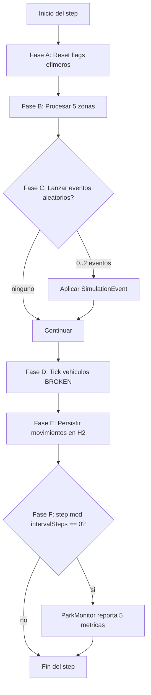
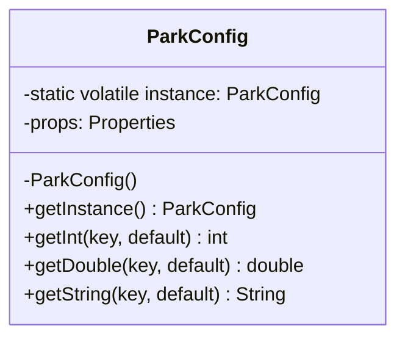
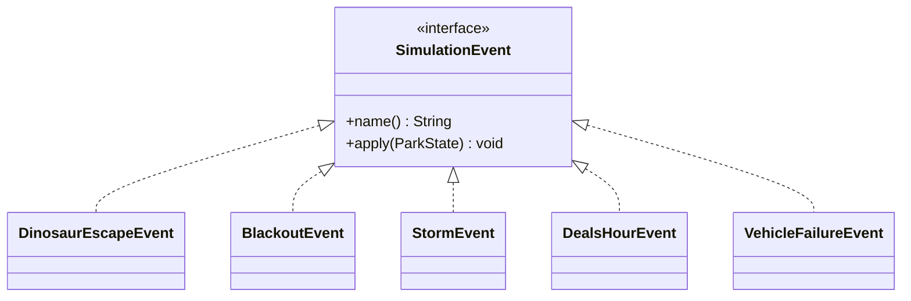

# Parque Turistico de Dinosaurios

**Simulacion secuencial no-determinista de un parque tematico con persistencia en H2 y patrones de diseno aplicados.**

Laboratorio 4 | Bloque 4 Intermedio | CPFIA Axity

| Campo | Valor |
|-------|-------|
| **Estudiante** | Iassiel Navih Meneses Gomez |
| **ID** | A36 |
| **Rama** | `feat/implementation` |
| **GitHub** | MenesesGomezIassielNavih |
| **Java** | 17 |

[](https://aws.amazon.com/corretto/)
[](https://maven.apache.org)
[](https://junit.org/junit5/)
[](https://www.jacoco.org/)
[](https://www.liquibase.org/)

---

## Tabla de Contenidos

- [Descripcion](#descripcion)
- [Arquitectura del Sistema](#arquitectura-del-sistema)
- [Herramientas Utilizadas](#herramientas-utilizadas)
- [Estructura del Proyecto](#estructura-del-proyecto)
- [Instrucciones de Configuracion](#instrucciones-de-configuracion)
- [Forma de Ejecucion](#forma-de-ejecucion)
- [Explicacion General del Sistema](#explicacion-general-del-sistema)
- [Patrones de Diseno Aplicados](#patrones-de-diseno-aplicados)
- [Pruebas Unitarias](#pruebas-unitarias)
- [Verificacion de la Base de Datos](#verificacion-de-la-base-de-datos)

---

## Descripcion

Simulacion secuencial de un parque turistico de dinosaurios que modela el flujo operativo durante N steps configurables. Turistas, dinosaurios, trabajadores y vehiculos interactuan dentro de cinco zonas funcionales mientras eventos aleatorios afectan el estado del parque. Toda la actividad se persiste en H2 mediante Liquibase: ingresos, gastos, eventos y estado de vehiculos.

Cada step recorre seis fases ordenadas: reset de flags, procesamiento de zonas, roll de eventos aleatorios, tick de vehiculos descompuestos, persistencia y reporte de metricas via ParkMonitor.

---

## Arquitectura del Sistema

### Arquitectura por Capas

El proyecto sigue una arquitectura limpia con separacion clara de responsabilidades organizada en siete paquetes funcionales bajo `com.axity.dinosaurpark`.



### Flujo de Ejecucion por Step



---

## Herramientas Utilizadas

| Componente | Tecnologia | Version |
|-----------|-----------|---------|
| Lenguaje | Java Eclipse Temurin | 17 |
| Build Tool | Apache Maven | 3.9+ |
| Base de Datos | H2 Database | 2.2.224 |
| Migraciones | Liquibase | 4.27.0 |
| Testing | JUnit Jupiter | 5.10.2 |
| Mocking | Mockito | 5.11.0 |
| Cobertura | JaCoCo | 0.8.12 |
| Logging | SLF4J + Logback | 2.0.13 / 1.5.15 |

```
laboratorio-bloque-4-axity/
├── backend/
│   ├── pom.xml
│   └── src/
│       ├── main/
│       │   ├── java/com/axity/dinosaurpark/
│       │   │   ├── Main.java
│       │   │   ├── config/        (ParkConfig Singleton, ParkConstants)
│       │   │   ├── model/         (Tourist, Dinosaur, Worker, Vehicle, Ticket)
│       │   │   ├── zone/          (ParkZone + 5 implementaciones)
│       │   │   ├── event/         (SimulationEvent + 5 implementaciones)
│       │   │   ├── persistence/   (DatabaseService con JDBC sostenido)
│       │   │   ├── simulation/    (ParkState, SimulationEngine, Pending records)
│       │   │   └── monitoring/    (ParkMonitor)
│       │   └── resources/
│       │       ├── park.properties
│       │       ├── logback.xml
│       │       └── db/changelog/  (master + 4 changesets v1.0)
│       └── test/java/             (14 clases de test, 36 casos)
└── docs/
    └── diagrams/                  (class.mmd, sequence.mmd, activity.mmd)
```

## Instrucciones de Configuracion

Los parametros operativos residen en `backend/src/main/resources/park.properties` y son cargados al arranque por el Singleton `ParkConfig`.

| Parametro | Tipo | Valor por defecto | Descripcion |
|-----------|------|-------------------|-------------|
| `simulation.steps` | int | 20 | Numero de steps de la simulacion |
| `simulation.initialTourists` | int | 15 | Turistas activos iniciales |
| `simulation.initialDinosaurs` | int | 8 | Dinosaurios iniciales |
| `simulation.initialEnergy` | double | 100.0 | Energia inicial |
| `simulation.maxEvents` | int | 2 | Maximo de eventos por step |
| `ticket.priceAdult` | decimal | 350.00 | Precio del boleto adulto |
| `souvenir.avgPrice` | decimal | 120.00 | Precio promedio de souvenir |
| `monitoring.intervalSteps` | int | 5 | Intervalo de reporte del Monitor |
| `dealsHour.discount` | double | 0.30 | Descuento de la hora de ofertas |
| `vehicleFailure.repairSteps` | int | 3 | Steps para reparar un vehiculo |
| `vehicles.initialCount` | int | 3 | Vehiculos iniciales |
| `db.url` | string | jdbc:h2:file:./data/parkdb | URL JDBC |

---

## Forma de Ejecucion

```bash
# Clonar y posicionarse en el modulo backend
git clone https://github.com/MenesesGomezIassielNavih/laboratorio-bloque-4-axity.git
cd laboratorio-bloque-4-axity/backend

# Compilar
mvn clean compile

# Ejecutar pruebas con cobertura JaCoCo
mvn clean verify

# Ejecutar la simulacion completa
mvn exec:java
```

La simulacion completa de veinte steps tarda aproximadamente trece segundos. El archivo `./data/parkdb.mv.db` queda poblado con las tablas `revenues`, `expenses`, `events` y `vehicles`.

---

## Explicacion General del Sistema

La simulacion se organiza en N steps secuenciales donde cada step ejecuta seis fases ordenadas. La fase A reinicia los flags efimeros del estado. La fase B procesa las cinco zonas del parque: ArrivalZone cobra boletos, CentralHub vende souvenirs, BathroomZone cobra servicios e incurre en mantenimiento, PowerPlant consume energia y solicita reparacion cuando cae por debajo del umbral critico, y ObservationEnclosure cuenta dinosaurios y recaptura los escapados.

La fase C rolea entre cero y dos eventos aleatorios del catalogo de cinco eventos, garantizando el comportamiento no determinista exigido por la rubrica. La fase D decrementa los contadores de reparacion de vehiculos descompuestos. La fase E persiste todos los movimientos del step en H2 mediante una conexion JDBC sostenida con PreparedStatements reutilizables. La fase F invoca al ParkMonitor que imprime las cinco metricas obligatorias cada N steps.

### Diagrama de Actividad del Step



---

## Patrones de Diseno Aplicados

### Singleton: ParkConfig

La clase `ParkConfig` implementa el patron Singleton mediante double-checked locking con la variable `instance` declarada como `volatile`, siguiendo la recomendacion del Item 83 de Effective Java tercera edicion. La eleccion responde a que la simulacion consulta los parametros aproximadamente ciento cincuenta veces por corrida, releer el archivo seria costoso por el overhead de IO, y permitir configuraciones inconsistentes generaria bugs sutiles.



### Strategy: SimulationEvent

La interfaz `SimulationEvent` define el contrato comun para los cinco eventos aleatorios del parque, y cada evento concreto encapsula su propio algoritmo. La eleccion elimina un switch por tipo de evento dentro del motor y permite agregar nuevos eventos sin tocar el codigo del `SimulationEngine`, respetando el principio Open/Closed.



---

## Pruebas Unitarias

La suite comprende treinta y seis casos distribuidos en catorce clases bajo `backend/src/test/java/com/axity/dinosaurpark/`. La estrategia prioriza clases con logica de negocio: cinco eventos del patron Strategy, cinco zonas del parque, sistema de monitoreo, motor de simulacion con Mockito, estado del parque y servicio de persistencia con BD H2 aislada por timestamp.

| Paquete | Clases de Test | Casos | Tecnica de Aislamiento |
|---------|----------------|-------|------------------------|
| `event/` | 5 | 11 | Random con semilla fija para reproducibilidad |
| `zone/` | 5 | 12 | Estado limpio por test (Arrange-Act-Assert) |
| `monitoring/` | 1 | 3 | Validacion de comportamiento sin BD |
| `simulation/` | 2 | 5 | Mockito con `@Mock DatabaseService` |
| `persistence/` | 1 | 5 | BD H2 aislada por `System.nanoTime()` |

### Resultado de la Ejecucion
Tests run: 36, Failures: 0, Errors: 0, Skipped: 0
BUILD SUCCESS
All coverage checks have been met.

JaCoCo aplica un umbral del 65% INSTRUCTION COVEREDRATIO a nivel BUNDLE. El reporte HTML queda disponible en `backend/target/site/jacoco/index.html`.

---

## Verificacion de la Base de Datos

Para validar que la simulacion persistio correctamente los datos, se ejecuta `org.h2.tools.RunScript` con un script SQL que cuenta las filas de cada tabla. Una corrida estandar de veinte steps produce los siguientes conteos:

| Tabla | Filas | Origen |
|-------|-------|--------|
| `revenues` | 60 | Tres ingresos por step durante veinte steps |
| `expenses` | 43 | Dos a tres gastos por step segun reparaciones |
| `events` | 21 | Variable segun roll aleatorio de eventos |
| `vehicles` | 3 | Upsert por MERGE mantiene tres filas |